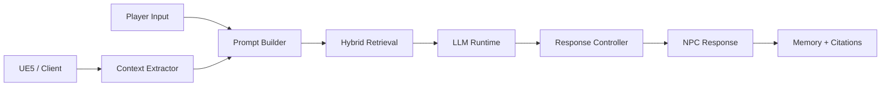

# NPC AI (BD-NSCA)

Behavior-Driven Neuro-Symbolic Cognitive Architecture for context-grounded NPC dialogue.

## Scope
- `cpp/`: low-latency runtime used by UE5/native serving.
- `core/` and `scripts/`: model iteration, evaluation, and benchmark pipelines.
- `docs/`: proposal alignment, benchmark evidence, architecture, and verification.

## Canonical Docs
- [Documentation Index](docs/README.md)
- [Architecture](docs/ARCHITECTURE.md)
- [Proposal Alignment](docs/PROPOSAL_ALIGNMENT.md)
- [Proposal Quality Bar](docs/PROPOSAL_QUALITY_BAR.md)
- [Industry Judgment](docs/INDUSTRY_PUBLICATION_JUDGMENT.md)
- [Final Benchmark Report](docs/FINAL_BENCHMARK_REPORT.md)
- [Kaggle Guide](docs/KAGGLE_GUIDE.md)

## High-Level Architecture


## Build (C++)
```powershell
cd cpp
cmake -B build
cmake --build build --config Release
```

## Full Results Checkout
Run the unified pipeline (proposal + publication + quality gate + comparison artifacts):
```powershell
python scripts/run_kaggle_full_results.py --host http://127.0.0.1:11434
```

Ablation option (skip keyword/random retrieval ablation baselines):
```powershell
python scripts/run_kaggle_full_results.py --host http://127.0.0.1:11434 --skip-ablation-baselines
```

## Notes
- Publication/benchmark claims are grounded in `artifacts/` runs referenced from `docs/`.
- Older planning notes and superseded deployment docs are kept under `docs/archive/legacy_20260225/`.
