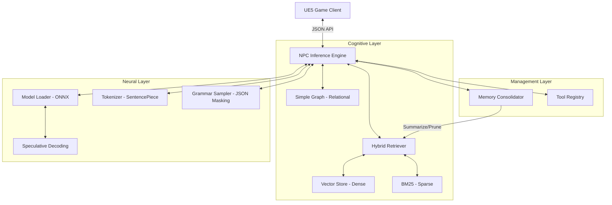

# NPC AI - Behavior-Driven Neuro-Symbolic Cognitive Architecture (BD-NSCA)

A state-of-the-art framework for creating intelligent, autonomous NPCs powered by fine-tuned Large Language Models and a multi-layered cognitive architecture. Specifically optimized for Vietnamese dialogue and integrated with Unreal Engine 5.

---

## System Architecture

The BD-NSCA architecture bridges the gap between raw neural power and symbolic control, ensuring NPCs are not only conversational but also consistent with game state and lore.



### ASCII Architecture View

```text
       +-----------------------+
       |   UE5 GAME CLIENT     |
       +-----------+-----------+
                   |
             [ JSON API ]
                   |
                   v
       +-----------------------+
       | NPC INFERENCE ENGINE  |<------[ State Management ]
       +-----------+-----------+
                   |
      +------------+------------+
      |                         |
      v                         v
+--------------+        +---------------+
| NEURAL LAYER |        | COGNITIVE LAYER|
+--------------+        +---------------+
| Model Loader |<------>| Hybrid Search |
| (Speculative)|        | (Dense/Sparse)|
|              |        |               |
| Tokenizer    |<------>| Vector Store  |
|              |        |               |
| Grammar      |<------>| Simple Graph  |
| Sampler      |        | (Relational)  |
+--------------+        +---------------+
      ^                         |
      |          +--------------+
      |          |
      |          v
+------------+-----------+
|    MANAGEMENT LAYER    |
+------------------------+
| Memory Consolidator    |
| Tool Registry          |
+------------------------+
```

### 1. Neural Layer (Inference)
- **ONNX Runtime Backend**: High-performance CPU/GPU inference for quantized LLMs (Phi-3, Llama).
- **Speculative Decoding**: Utilizes a lightweight "draft model" (e.g., Llama-68M) to accelerate generation from the main model.
- **Strict Grammar Enforcement**: A custom GrammarSampler masks logits during generation to guarantee valid JSON or structured output, essential for tool calling.

### 2. Cognitive Layer (Memory & Knowledge)
- **Hybrid Retrieval System**: Combines dense semantic search (Vector Store via usearch) with sparse keyword matching (BM25) for high-accuracy context retrieval.
- **Relational Knowledge Graph**: A SimpleGraph implementation maps NPC relationships and world facts, allowing NPCs to "know" who they are talking to and how they feel about them.
- **Intelligent Sleep Cycles**: The MemoryConsolidator periodically assesses memory importance. Trivial memories are pruned, while significant interactions are summarized to preserve long-term relevance without context bloat.

### 3. Symbolic Layer (Decision & Control)
- **Behavior Trees**: Integration with standard AI decision trees for high-level state management (Guard, Patrol, Sleep, Interact).
- **Tool Execution Registry**: A functional grounding system allowing NPCs to recall specific memories, search knowledge, or check environment state (Time, Weather) through standardized tool calls.

---

## Key Features

- **Vietnamese Optimized**: Fine-tuned for natural, persona-driven Vietnamese dialogue.
- **Real-time Performance**: Optimized for low-latency responses suitable for gaming.
- **Advanced RAG**: Multi-stage retrieval combining semantic meaning and exact keyword hits.
- **Extensible Tools**: Easily add new "skills" to NPCs through the C++ Tool Registry.
- **Production Robust**: Comprehensive C++ implementation with built-in error handling and state persistence.

---

## Project Structure

```
NPC AI/
├── cpp/                    # Core C++ Inference Engine (BD-NSCA Implementation)
│   ├── include/            # Public Header API
│   ├── src/               # Component Implementation
│   └── tests/             # Comprehensive Test Suites (Logic, Grammar, Integration)
├── data/                   # Training datasets and seed data
├── scripts/                # Python pipeline (Generation, Training, Export)
│   ├── export_to_onnx.py   # Model conversion utility
│   └── generate_data.py    # Synthetic dialogue generation
├── ue5/                    # Unreal Engine 5 integration components
└── models/                 # Model files (ONNX, Tokenizers, Adapters)
```

---

## Getting Started (C++ Engine)

### Prerequisites
- **Windows** (Optimized for MSVC/Powershell)
- **CMake 3.15+**
- **Visual Studio 2022** (with C++ Desktop development)

### Build Instructions
```powershell
# Navigate to C++ directory
cd cpp

# Configure and build (auto-downloads ONNX Runtime, SentencePiece, usearch)
cmake -B build
cmake --build build --config Release
```

### Running Tests
The project includes specialized tests to verify each architectural layer:
```powershell
# 1. Verify Retrieval Logic
./build/Release/test_fix.exe

# 2. Verify Grammar Enforcement
./build/Release/test_grammar.exe

# 3. Verify Full System Loop (Init -> Remember -> Generate -> Sleep)
./build/Release/test_integration.exe
```

---

## Usage Example

```cpp
#include "NPCInference.h"

// 1. Initialize Engine
NPCInference::NPCInferenceEngine engine;
NPCInference::InferenceConfig config;
config.model_dir = "models/phi3-tuned";
engine.Initialize(config);

// 2. Add Memory
engine.Remember("The player gave me a health potion.", {{"type", "event"}, {"emotion", "joy"}});

// 3. Generate Autonomous Response
std::string response = engine.GenerateFromContext(
    "You are a grateful villager.", 
    "Villager_A", 
    "Market Square", 
    "I hope that potion helps you!"
);
```

---

## License
This project is licensed under the MIT License.
