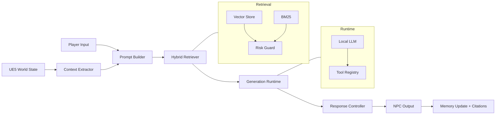
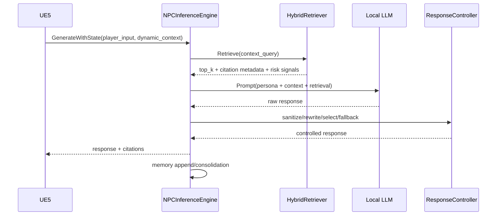
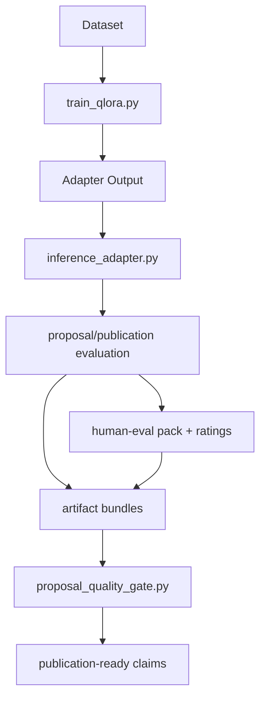
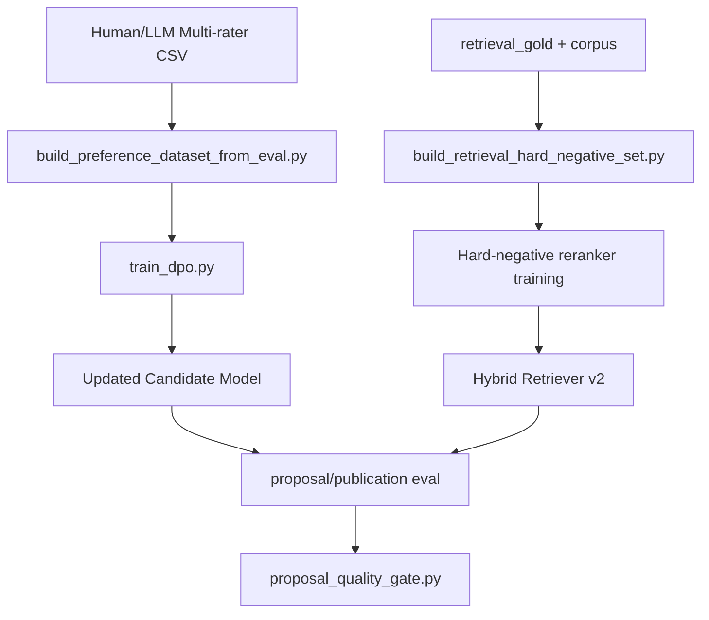

# NPC AI Architecture

## Scope
This document is the architecture source of truth for:
- runtime behavior (`cpp/`, UE5 integration)
- training/evaluation behavior (`core/`, `scripts/`)
- publication evidence linkage (`artifacts/`)

## System Overview

## Runtime Sequence (UE5 -> Response)

## Training/Evaluation Path

## Significant-Improvement Loop

## Key Components
1. Context Extractor
- Pulls behavior state, spatial state, nearby entities, and recent events from UE5.

2. Hybrid Retriever
- Fuses dense + sparse retrieval.
- Applies trust/injection-risk guard before final top-k selection.

3. Prompt Builder
- Formats persona, dynamic context, and selected evidence into a constrained prompt layout.

4. Generation Runtime
- Uses local model serving path (Ollama/native path depending on run configuration).

5. Response Controller
- Sanitizes raw output.
- Optionally rewrites and scores multiple candidates.
- Falls back to grounded safe reply if thresholds are not met.

6. Memory + Citations
- Stores response-linked evidence with bounded context payload.

7. Quality Gate
- Enforces proposal/publication quality-bar checks over generated artifacts.
- Verifies scenario coverage, significance wins, metadata completeness, and security metrics.

## Runtime Invariants
- Every response path must support no-crash fallback behavior.
- Retrieval payload must be bounded to avoid prompt explosion.
- Controlled output must preserve persona/context constraints.
- Any superiority claim must map to artifact-backed metrics.

## Unified Checkout
- End-to-end reproducible run (Kaggle/local): `scripts/run_kaggle_full_results.py`
- Produces a single manifest: `artifacts/final_checkout/<timestamp>/manifest.json`

## Primary File Map
- `cpp/src/NPCInference.cpp`
- `cpp/src/HybridRetriever.cpp`
- `cpp/src/ResponseController.cpp`
- `core/response_controller.py`
- `scripts/inference_adapter.py`
- `scripts/run_proposal_alignment_eval.py`
- `scripts/run_publication_benchmark_suite.py`
- `scripts/run_kaggle_full_results.py`
- `scripts/build_human_eval_pack.py`
- `scripts/run_llm_multirater_campaign.py`
- `scripts/build_preference_dataset_from_eval.py`
- `scripts/build_retrieval_hard_negative_set.py`
- `scripts/proposal_quality_gate.py`
